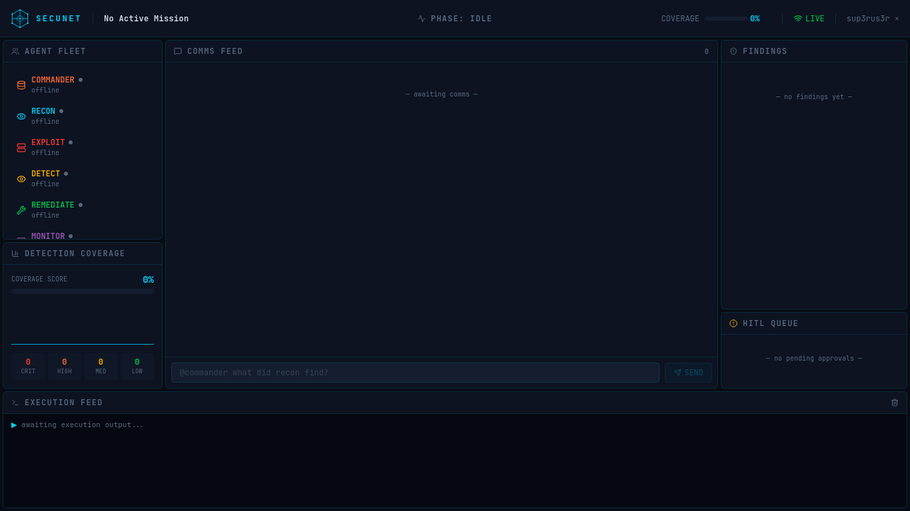
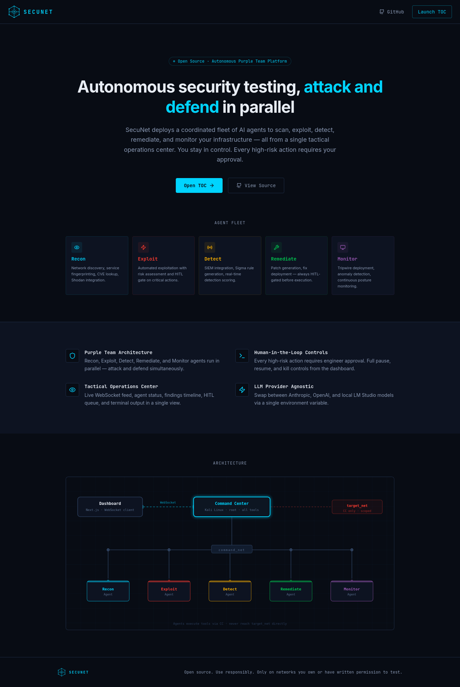

<div align="center">



### Open-Source Autonomous Purple Team Platform

Deploy a coordinated fleet of AI agents to scan, exploit, detect, remediate, and monitor your infrastructure — all from a single tactical operations center.

[](LICENSE)
[](https://github.com/sup3rus3r/secunet/stargazers)
[](https://github.com/sup3rus3r/secunet/network/members)
[](https://github.com/sup3rus3r/secunet/issues)
[](https://www.python.org/)
[](https://nextjs.org/)
[](https://fastapi.tiangolo.com/)
[](https://www.kali.org/)
[](https://docs.docker.com/compose/)
[](https://redis.io/)

</div>

---

> **Responsible Use** — SecuNet is designed for authorised security testing only. Only use it on networks and systems you own or have explicit written permission to test. All activity is logged.

---

## What is SecuNet?

SecuNet is an autonomous purple team platform that deploys five specialised AI agents working in concert — **attacking and defending simultaneously**. The Command Center runs on a Kali Linux container as root, giving agents access to the full offensive toolkit (nmap, Metasploit, Hydra, Nikto, Gobuster, and more) through a scoped execution API.

All high-risk actions are gated behind a **Human-in-the-Loop (HITL)** approval queue visible directly in the tactical dashboard. Engineers maintain full control at all times.



---

## ⚠️ LLM Provider Notes

**Tested and recommended: [Fireworks AI](https://fireworks.ai)**

SecuNet has been tested in production with **Fireworks AI** using the `kimi-k2p5` model. This is the recommended provider because:

- Fireworks models do not refuse offensive security tool use (nmap, Metasploit, exploit generation)
- Lower latency and predictable behaviour under agentic tool-call loops
- Tested model: `accounts/fireworks/models/kimi-k2p5`

**Claude (Anthropic) and OpenAI are unpredictable for this use case.** Both providers apply content filtering to offensive security tasks even within legitimate penetration testing contexts. Agents may refuse to generate exploit code, nmap scans, or credential testing commands — breaking the autonomous loop silently. If you choose to use Anthropic or OpenAI, expect inconsistent results and manual intervention.

**LM Studio** (local models) is supported and works well if you have a capable GPU. Set `LLM_PROVIDER=lmstudio` and point `LMSTUDIO_BASE_URL` at your LM Studio server.

| Provider | `LLM_PROVIDER` | Reliability for offensive use |
|----------|----------------|-------------------------------|
| **Fireworks AI** | `fireworks` | ✅ Recommended |
| LM Studio (local) | `lmstudio` | ✅ Good (hardware dependent) |
| Anthropic Claude | `anthropic` | ⚠️ Unpredictable — may refuse tool calls |
| OpenAI GPT | `openai` | ⚠️ Unpredictable — may refuse tool calls |

---

## Agent Fleet

| Agent | Color | Role |
|-------|-------|------|
| **Recon** | `#00D4FF` | Network discovery, port scanning, service fingerprinting, CVE lookup, Shodan |
| **Exploit** | `#FF3B30` | Automated exploitation with CVSS risk assessment and HITL gate for critical actions |
| **Detect** | `#FFB300` | SIEM integration (Splunk, Elastic, Sentinel), Sigma rule generation, detection scoring |
| **Fix Advisor** | `#00C851` | Generates Ansible playbooks and fix packages per finding — ZIP download, no credentials required |
| **Monitor** | `#9B59B6` | Tripwire deployment, anomaly detection, continuous posture monitoring |

All agents communicate exclusively through **Commander** — the sole entity that routes work, tasks agents, and decides what to surface to the engineer. Agents never receive messages from anyone other than Commander and never broadcast output directly.

---

## Architecture

```
Dashboard (Next.js)  <-- WebSocket -->  Command Center (Kali Linux · root)
                                                   |
                        +--------------------------+--------------------------+
                        |                          |                          |
                   command_net                command_net                command_net
                   Recon Agent               Exploit Agent              Detect Agent
                  Remediate Agent            Monitor Agent

                  All execution flows through Command Center Kali.
                  Agents never reach target_net directly.
```

- **Command Center** is the only container on all 3 networks (`dashboard_net`, `command_net`, `target_net`)
- **Agents** are lightweight Python containers — they send `execute()` requests to CC, which runs tools on Kali
- **Commander** is the sole router: every message goes to Commander first; only Commander writes to agent inboxes
- **Parallel tasking**: Commander dispatches multiple agents simultaneously (e.g. Recon + Detect baseline at the same time) when the work is parallelisable
- **Dashboard** is a live WebSocket view — all state streamed from CC
- **Commander Agent** is the sole writer to the vector store — all context flows through it

---

## Features

- **Autonomous purple team loop** — attack and defend in parallel, 24/7
- **Human-in-the-Loop controls** — approve or deny any high-risk action from the TOC dashboard
- **Mission controls** — pause, resume, kill, or force HITL mode across all agents instantly
- **Multi-provider LLM** — swap Fireworks / Anthropic / OpenAI / LM Studio via a single env var
- **Commander memory** — three-layer context engine (Redis rolling window, ChromaDB vector store, PostgreSQL cold storage)
- **MITRE ATT&CK scoped execution** — every command tagged with a technique ID, scope-enforced
- **Commander-centric routing** — all messages flow through Commander; only Commander tasks agents; agents are deaf to everything else
- **Parallel agent tasking** — Commander dispatches multiple agents simultaneously when work can run in parallel
- **Activity Feed** — real-time Commander decision trail (inbound results, outbound tasks) separate from the Comms feed
- **Live tactical dashboard** — agent status, comms, activity trail, findings, HITL queue, metrics, terminal feed
- **Session management** — New Session wipes all memory layers (Redis, ChromaDB, PostgreSQL, frontend stores)
- **PDF report generation** — downloadable penetration test report with executive summary, findings, exploit log, and remediation plan (`GET /report/pdf`)
- **Fix Advisor** — per-finding ZIP packages containing a complete Ansible playbook, plain English instructions, and README; downloadable from the Findings panel
- **Clean execution feed** — nmap output shown in human-readable format; XML is parsed internally and never surfaced to the terminal
- **SIEM integrations** — Splunk, Elasticsearch, Microsoft Sentinel

---

## Quick Start

### Prerequisites

| Tool | Version |
|------|---------|
| Docker | 24+ |
| Docker Compose | v2+ |
| make | any (Linux/macOS) |

### 1. Clone

```bash
git clone https://github.com/sup3rus3r/secunet.git
cd secunet
```

### 2. Configure environment

```bash
cp .env.example .env
```

Open `.env` and set your LLM API key. **Fireworks AI is recommended:**

```env
LLM_PROVIDER=fireworks
FIREWORKS_API_KEY=fw_...          # ← your Fireworks key
FIREWORKS_MODEL=accounts/fireworks/models/kimi-k2p5
```

Or use Anthropic (note: may refuse offensive tool calls):

```env
LLM_PROVIDER=anthropic
ANTHROPIC_API_KEY=sk-ant-...
```

All secrets, infra URLs, and defaults are pre-filled and work out of the box.

### 3. Start everything

```bash
make up
```

All 11 services start in the correct order.

| Service | Port | Description |
|---------|------|-------------|
| `dashboard` | 3000 | Next.js tactical operations center |
| `command-center` | 8001 | FastAPI + Kali Linux + all tools |
| `backend` | 8000 | Auth service (JWT + MongoDB) |
| `recon-agent` | — | Autonomous recon agent |
| `exploit-agent` | — | Autonomous exploit agent |
| `detect-agent` | — | Autonomous detection agent |
| `remediate-agent` | — | Autonomous remediation agent |
| `monitor-agent` | — | Autonomous monitoring agent |
| `redis` | — | Pub/sub message bus |
| `postgres` | — | Cold storage audit log |
| `mongo` | — | Auth database |

Open `http://localhost:3000` → register an account → the TOC dashboard connects automatically.

---

## Windows

`make` is not available on Windows natively. Two options:

### Option 1 — WSL2 (recommended)

1. Install [WSL2](https://learn.microsoft.com/en-us/windows/wsl/install) and [Docker Desktop](https://www.docker.com/products/docker-desktop/)
2. Enable **WSL2 integration** in Docker Desktop → Settings → Resources → WSL Integration
3. Open a WSL2 terminal and follow the standard Quick Start above

### Option 2 — npm scripts

| make | npm |
|------|-----|
| `make up` | `npm run up` |
| `make down` | `npm run down` |
| `make logs` | `npm run logs` |
| `make reset` | `npm run reset` |

---

## Commands

```bash
make up            # Start all services
make down          # Stop all services
make logs          # Tail all logs
make status        # Show container status + Kali tool versions
make reset         # Wipe everything (volumes) and rebuild from scratch
make report        # Dump mission report JSON to stdout
make build         # Rebuild all images without cache

# Per-agent logs
make cc
make recon
make exploit
make detect
make remediate
make monitor
```

---

## Dashboard

The TOC dashboard at `http://localhost:3000` provides:

- **Agent Fleet** — live status of all 5 agents
- **Activity Feed** — Commander's decision trail: every inbound result and outbound task dispatch, one line each
- **Comms Feed** — Commander ↔ Engineer dialogue only; clean and intentional, no raw agent output
- **Findings Panel** — all discovered vulnerabilities, severity-sorted; FIX download button appears when Fix Advisor has packaged a fix
- **HITL Queue** — approve or deny high-risk actions before agents execute
- **Execution Feed** — live terminal output of every tool invoked on the Kali host
- **ATT&CK Coverage** — MITRE technique heatmap updated in real time
- **Metrics Panel** — hosts, findings, coverage score, detection score
- **Report** — generate and download a professional PDF penetration test report
- **New Session** — wipes all memory layers and all dashboard feeds for a clean engagement start

---

## Fix Advisor

When Commander tasks the Fix Advisor agent with a finding, it generates a downloadable fix package and uploads it to the Command Center. A **FIX ↓** button appears on the finding card in the dashboard.

Each ZIP contains:

| File | Contents |
|------|----------|
| `playbook.yml` | Complete runnable Ansible playbook with vars, tasks, and verification step |
| `INSTRUCTIONS.md` | Step-by-step guide — Ansible method and manual fallback |
| `README.md` | Summary table, CVE details, and quick-start command |

```bash
# Apply the fix
ansible-playbook -i "192.168.1.10," playbook.yml

# Or against an inventory group
ansible-playbook -i inventory.ini playbook.yml --limit 192.168.1.10
```

No credentials are stored by the platform. The engineer downloads the ZIP and hands it to their sysadmin to apply.

Packages are also accessible directly:
```
GET http://localhost:8001/remediation/{finding_id}/download
GET http://localhost:8001/remediation   # list all available packages
```

---

## PDF Report

SecuNet generates a professional, downloadable PDF report from the engagement data:

- **Cover page** — mission name, scope, classification, risk level
- **Executive Summary** — metrics grid, ATT&CK coverage, detection score
- **Findings** — full table with severity, host, CVE, description, remediation status
- **Attack Log** — all exploit attempts and outcomes
- **Remediation Plan** — step-by-step actions for each open finding, ordered by severity
- **Sign-off page** — metadata summary and authorisation block

Access via the **REPORT** button in the dashboard TopBar, or directly:
```
GET http://localhost:8001/report      # JSON
GET http://localhost:8001/report/pdf  # PDF download
```

---

## Environment Variables

### LLM Provider (set one)

| Variable | Default | Description |
|----------|---------|-------------|
| `LLM_PROVIDER` | `fireworks` | `fireworks` \| `anthropic` \| `openai` \| `lmstudio` |
| `FIREWORKS_API_KEY` | — | Fireworks AI API key (recommended) |
| `FIREWORKS_BASE_URL` | `https://api.fireworks.ai/inference/v1` | Fireworks endpoint |
| `FIREWORKS_MODEL` | `accounts/fireworks/models/kimi-k2p5` | Fireworks model ID |
| `ANTHROPIC_API_KEY` | — | Anthropic API key |
| `ANTHROPIC_MODEL` | `claude-opus-4-6` | Anthropic model ID |
| `OPENAI_API_KEY` | — | OpenAI API key |
| `OPENAI_MODEL` | `gpt-4o` | OpenAI model ID |
| `LMSTUDIO_BASE_URL` | `http://host.docker.internal:1234/v1` | LM Studio endpoint |
| `LMSTUDIO_MODEL` | — | Model name as shown in LM Studio |

### Mission

| Variable | Default | Description |
|----------|---------|-------------|
| `TARGET_SCOPE` | — | CIDR for headless runs. Set live from the dashboard. |
| `MISSION_NAME` | — | Human-readable engagement name |
| `AGGRESSION_LEVEL` | `medium` | `low` \| `medium` \| `high` |
| `CRITICAL_RISK_REQUIRES_HITL` | `true` | Gate critical exploits behind HITL |
| `DC_REQUIRES_HITL` | `true` | Gate domain-controller attacks behind HITL |
| `DETECTION_THRESHOLD` | `0.6` | Detection score threshold (0–1) |
| `RECON_INTERVAL` | `3600` | Recon cycle interval in seconds |

See [`.env.example`](.env.example) for the full reference.

---

## Project Structure

```
secunet/
├── command-center/          # FastAPI app — Kali Linux, all tools, root
│   ├── api/                 # Agent gateway, execution, HITL, WebSocket
│   ├── comm_hub/            # Redis pub/sub bus + message router
│   ├── commander/           # Memory engine (ChromaDB, Redis, PostgreSQL) + report builder
│   ├── egress_proxy/        # Outbound request logging + policy enforcement
│   └── llm_client.py        # Provider-agnostic LLM abstraction
│
├── agents/
│   ├── base/                # BaseAgent, CCClient, CommanderClient, WebClient
│   ├── recon/               # Recon agent (nmap, Shodan, CVE lookup)
│   ├── exploit/             # Exploit agent (Metasploit, risk assessment, HITL)
│   ├── detect/              # Detect agent (SIEM, Sigma rules, coverage scoring)
│   ├── remediate/           # Fix Advisor agent (Ansible playbook + ZIP generation, no auto-deploy)
│   └── monitor/             # Monitor agent (tripwires, anomaly detection)
│
├── dashboard/               # Next.js — Tactical Operations Center
│   ├── app/                 # Landing, login, register, TOC (home)
│   ├── components/toc/      # TopBar, AgentStatus, Chat, ActivityFeed, Findings, HITL, Metrics, Terminal, ReportModal
│   ├── store/               # Zustand stores (mission, agents, messages, findings, hitl, terminal, coverage, activity)
│   └── lib/ws-client.ts     # WebSocket singleton with exponential backoff
│
├── backend/                 # Auth service (FastAPI, MongoDB, JWT, bcrypt)
├── shared/                  # Canonical Pydantic schemas + MITRE ATT&CK reference
├── docs/images/             # Screenshots
├── docker-compose.yml       # Full stack — 11 services, 3 networks
├── Makefile                 # make up · make down · make reset · make report
└── .env.example             # Environment variable reference
```

---

## Tech Stack

| Layer | Stack |
|-------|-------|
| **Command Center** | Python 3.12, FastAPI, Uvicorn, Kali Linux |
| **Memory Engine** | ChromaDB (vector), Redis 7 (rolling window), PostgreSQL 16 (cold storage) |
| **Agent Fleet** | Python 3.12, httpx, asyncio, redis-py |
| **LLM** | Fireworks AI / Anthropic Claude / OpenAI GPT / LM Studio (local) |
| **PDF Reports** | WeasyPrint (HTML → PDF, server-side rendering) |
| **Dashboard** | Next.js 16, TypeScript, Tailwind CSS v4, Zustand |
| **Auth** | NextAuth v5, JWT, bcrypt, AES-256-CBC, MongoDB |
| **Infrastructure** | Docker Compose, Redis Alpine, PostgreSQL Alpine |

---

## Contributing

Contributions are welcome. Please read [CONTRIBUTING.md](CONTRIBUTING.md) before submitting a pull request.

- Bug reports → [GitHub Issues](https://github.com/sup3rus3r/secunet/issues)
- Security vulnerabilities → see [SECURITY.md](SECURITY.md)
- Code of conduct → [CODE_OF_CONDUCT.md](CODE_OF_CONDUCT.md)

---

## License

SecuNet is licensed under the **GNU Affero General Public License v3.0 (AGPL-3.0)**.

See [LICENSE](LICENSE) for full terms.

---

## Contact

| | |
|--|--|
| **Author** | Mohammed Khan |
| **Email** | mkhan@live.co.za |
| **GitHub** | [@sup3rus3r](https://github.com/sup3rus3r) |
